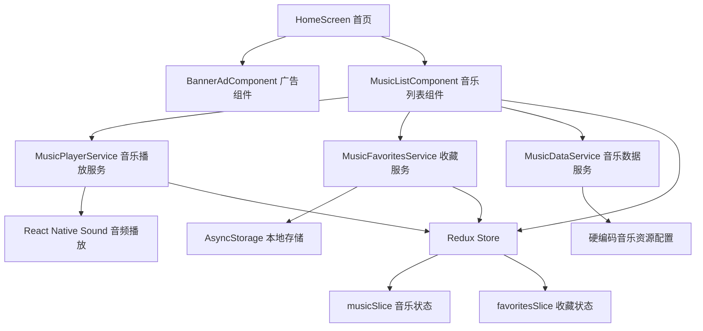

# 设计文档

## 概述

将叮叮猫应用转型为自然音乐体验应用，主要功能是让用户体验各种自然环境音和放松音乐。音乐播放器和收藏功能将成为应用的核心功能，集成到首页中，在保留顶部banner广告位的基础上，添加一个美观简约的音乐列表组件。设计参考 Moodist 网站的简洁风格，提供沉浸式的自然音乐体验和便捷的收藏管理。

## 架构

### 系统架构图



### 数据流架构

1. **音乐数据获取**: MusicDataService → Redux Store → MusicListComponent
2. **音乐播放**: MusicListComponent → MusicPlayerService → React Native Sound
3. **收藏管理**: MusicListComponent → MusicFavoritesService → AsyncStorage → Redux Store

## 组件和接口

### 1. MusicListComponent 音乐列表组件

**职责**: 显示音乐列表，处理播放和收藏操作

**Props接口**:
```typescript
interface MusicListComponentProps {
  style?: ViewStyle;
  onMusicPlay?: (music: MusicItem) => void;
  onMusicPause?: () => void;
  onFavoriteToggle?: (music: MusicItem, isFavorited: boolean) => void;
}
```

**状态管理**:
- 当前播放音乐
- 播放状态（播放中/暂停/停止）
- 收藏列表
- 加载状态

### 2. MusicPlayerService 音乐播放服务

**职责**: 管理音频播放、暂停、停止等操作

**主要方法**:
```typescript
class MusicPlayerService {
  // 多音源播放管理
  static async addTrack(music: MusicItem): Promise<void>
  static async removeTrack(musicId: string): Promise<void>
  static async pauseTrack(musicId: string): Promise<void>
  static async resumeTrack(musicId: string): Promise<void>
  static async stopAllTracks(): Promise<void>
  static async pauseAllTracks(): Promise<void>
  static async resumeAllTracks(): Promise<void>
  
  // 音量控制
  static async setTrackVolume(musicId: string, volume: number): Promise<void>
  static async setMasterVolume(volume: number): Promise<void>
  static async fadeInTrack(musicId: string, duration: number): Promise<void>
  static async fadeOutTrack(musicId: string, duration: number): Promise<void>
  
  // 状态查询
  static getPlayingTracks(): PlayingTrack[]
  static isTrackPlaying(musicId: string): boolean
  static getTrackVolume(musicId: string): number
}
```

### 3. MusicFavoritesService 收藏服务

**职责**: 管理音乐收藏的本地存储

**主要方法**:
```typescript
class MusicFavoritesService {
  static async getFavorites(): Promise<MusicItem[]>
  static async addToFavorites(music: MusicItem): Promise<void>
  static async removeFromFavorites(musicId: string): Promise<void>
  static async isFavorited(musicId: string): Promise<boolean>
  static async clearAllFavorites(): Promise<void>
}
```

### 4. MusicDataService 音乐数据服务

**职责**: 提供硬编码的音乐资源数据

**主要方法**:
```typescript
class MusicDataService {
  static getMusicCategories(): MusicCategory[]
  static getMusicList(category?: string): MusicItem[]
  static getMusicById(id: string): MusicItem | null
  static searchMusic(query: string): MusicItem[]
}
```

## 数据模型

### MusicItem 音乐项目模型

```typescript
interface MusicItem {
  id: string;                    // 唯一标识符
  title: string;                 // 音乐标题
  category: string;              // 音乐分类
  audioPath: string;             // 音频文件相对路径
  audioUrl: string;              // 完整音频文件URL（由baseUrl + audioPath组成）
  icon: string;                  // 音乐图标（emoji）
  description?: string;          // 描述
  isLooping: boolean;            // 是否循环播放（默认true）
}

### 硬编码音乐资源配置

```typescript
interface MusicConfig {
  baseUrl: string;               // 音频资源基础URL
  categories: MusicCategory[];   // 音乐分类列表
  musicItems: MusicItem[];       // 所有音乐项目
}

// 配置示例
const MUSIC_CONFIG: MusicConfig = {
  baseUrl: 'https://moodist.mvze.net',
  categories: [
    { id: 'animals', name: '动物声音', icon: '🐾' },
    { id: 'binaural', name: '双耳节拍', icon: '🧠' },
    { id: 'nature', name: '自然声音', icon: '🌿' },
    { id: 'noise', name: '白噪音', icon: '📻' },
    { id: 'places', name: '场所环境', icon: '🏢' },
    { id: 'rain', name: '雨声', icon: '🌧️' },
    { id: 'things', name: '物品声音', icon: '⚙️' },
    { id: 'transport', name: '交通工具', icon: '🚗' },
    { id: 'urban', name: '城市声音', icon: '🏙️' }
  ],
  musicItems: [
    // animals 分类
    { id: 'birds', title: '鸟鸣声', category: 'animals', audioPath: '/sounds/animals/birds.mp3', icon: '🐦', isLooping: true },
    { id: 'seagulls', title: '海鸥声', category: 'animals', audioPath: '/sounds/animals/seagulls.mp3', icon: '🕊️', isLooping: true },
    // ... 更多音乐项目
  ]
}
```
```

### MusicCategory 音乐分类模型

```typescript
interface MusicCategory {
  id: string;                    // 分类ID
  name: string;                  // 分类名称
  icon: string;                  // 分类图标（emoji）
  description?: string;          // 分类描述
}
```

### PlaybackState 播放状态模型

```typescript
interface PlaybackState {
  isPlaying: boolean;                    // 是否有音乐在播放
  playingTracks: PlayingTrack[];         // 当前播放的音乐轨道列表
  masterVolume: number;                  // 主音量 (0-1)
}

interface PlayingTrack {
  music: MusicItem;                      // 音乐信息
  soundInstance: Sound;                  // 音频实例
  volume: number;                        // 该轨道的音量 (0-1)
  isLooping: boolean;                    // 是否循环播放
  startTime: number;                     // 开始播放时间戳
}
```

## UI设计规范

### 1. 布局结构

**首页布局顺序**:
1. Header（应用标题）
2. BannerAdComponent（横幅广告）
3. **MusicListComponent（音乐列表 - 主要内容区域）**

**移除的组件**:
- UserCard（用户信息卡片）
- AdSection（广告按钮区域 - 开屏、视频激励、插屏广告按钮）
- InfoCard（温馨提示卡片）
- 历史菜单和相关功能

**导航栏简化**:
- 移除历史记录标签页
- 保留首页作为主要音乐体验界面
- 可考虑添加收藏夹标签页（如果需要独立的收藏管理界面）

### 2. 音乐列表组件设计

**参考Moodist风格的设计元素**:
- 简洁的卡片式布局
- 柔和的圆角设计（16px）
- 清晰的视觉层次
- 舒缓的配色方案
- 自然主题的图标和插图
- 专注于放松和冥想的用户体验

**音乐项目卡片结构**（简化交互）:
```
┌─────────────────────────────────────┐
│ [🎵] 音乐标题                    [♡] │
│      分类 • 循环播放                 │
│ ─────────────────────────────────── │
│ 点击卡片播放/停止 • 高亮显示播放状态   │
└─────────────────────────────────────┘
```

**交互说明**:
- 点击卡片：开始播放该音乐（可叠加多个）
- 再次点击已播放的卡片：停止该音乐
- 播放中的卡片：高亮显示（背景色变化）
- 收藏按钮：独立的收藏/取消收藏功能
- 不显示复杂的播放控制面板

### 3. 颜色方案

**主色调**（参考Moodist）:
- 主色: `#6366F1` (柔和紫色)
- 辅助色: `#10B981` (薄荷绿)
- 背景色: `#F8FAFC` (浅灰)
- 卡片背景: `#FFFFFF` (白色)
- 文字主色: `#1F2937` (深灰)
- 文字辅色: `#6B7280` (中灰)

**状态颜色**:
- 播放中: `#10B981` (绿色)
- 已收藏: `#EF4444` (红色)
- 未收藏: `#9CA3AF` (灰色)
- 多音源播放指示: `#3B82F6` (蓝色)
- 音量滑块: `#6366F1` (紫色)

### 4. 字体规范

- 音乐标题: 16px, 粗体
- 分类/时长: 14px, 常规
- 按钮文字: 14px, 中等粗细

### 5. 间距规范

- 组件间距: 16px
- 卡片内边距: 16px
- 元素间距: 8px
- 圆角半径: 12px (小元素), 16px (卡片)

## 错误处理

### 1. 音频加载错误处理

**场景**: 音频文件网络加载失败
**处理**: 
- 显示友好的错误提示
- 提供重试按钮
- 标记失败的音频项目

### 2. 音频播放错误处理

**场景**: 音频文件加载或播放失败
**处理**:
- 显示播放失败提示
- 自动尝试重新加载
- 提供跳过当前音乐的选项

### 3. 本地存储错误处理

**场景**: AsyncStorage读写失败
**处理**:
- 使用内存中的临时收藏列表
- 显示存储失败警告
- 在下次启动时重试同步

### 4. 权限错误处理

**场景**: 音频播放权限被拒绝
**处理**:
- 显示权限请求说明
- 引导用户到设置页面
- 提供静音模式选项

## 测试策略

### 1. 单元测试

**测试范围**:
- MusicPlayerService 的所有方法
- MusicFavoritesService 的数据操作
- MoodistApiService 的API调用
- Redux reducers 和 actions

**测试工具**: Jest + React Native Testing Library

### 2. 集成测试

**测试场景**:
- 音乐播放流程（加载→播放→暂停→停止）
- 收藏功能流程（添加→保存→加载→删除）
- 错误恢复流程（网络错误→重试→成功）

### 3. UI测试

**测试内容**:
- 组件渲染正确性
- 用户交互响应
- 状态变化的视觉反馈
- 不同屏幕尺寸的适配

### 4. 性能测试

**测试指标**:
- 音乐列表加载时间
- 音频播放延迟
- 内存使用情况
- 电池消耗影响

## 技术实现细节

### 1. 音频播放技术栈

**选择**: react-native-sound
**原因**: 
- 成熟稳定的音频播放库
- 支持流媒体播放
- 支持多个音频实例同时播放（多音源叠加的关键）
- 良好的性能表现
- 跨平台兼容性

**多音源播放实现**:
- 每个音乐创建独立的Sound实例
- 使用音频混合技术实现多轨道同时播放
- 实现单独的音量控制和主音量控制
- 支持音频淡入淡出效果

### 2. 启动页文案更新

**应用定位调整**: 将应用重新定位为自然音乐体验应用
**启动页文案优化**: 
- 移除技术性的初始化文案
- 使用更贴近自然音乐主题的文案
- 统一使用"资源加载中..."替代具体的技术步骤

**新的启动文案**:
```typescript
const INIT_MESSAGES = {
  [InitPhase.STARTING]: '准备自然音乐体验...',
  [InitPhase.AUTH_CHECK]: '加载个人设置...',
  [InitPhase.CONFIG_LOADING]: '准备音乐资源...',
  [InitPhase.DEVICE_INFO]: '优化音频设置...',
  [InitPhase.RISK_CONTROL]: '确保播放质量...',
  [InitPhase.OFFLINE_SYNC]: '同步收藏音乐...',
  [InitPhase.COMPLETED]: '欢迎来到自然音乐世界',
  [InitPhase.FAILED]: '加载失败，请重试',
};
```

或者更简化的版本：
```typescript
const INIT_MESSAGES = {
  [InitPhase.STARTING]: '资源加载中...',
  [InitPhase.AUTH_CHECK]: '资源加载中...',
  [InitPhase.CONFIG_LOADING]: '资源加载中...',
  [InitPhase.DEVICE_INFO]: '资源加载中...',
  [InitPhase.RISK_CONTROL]: '资源加载中...',
  [InitPhase.OFFLINE_SYNC]: '资源加载中...',
  [InitPhase.COMPLETED]: '欢迎体验自然音乐',
  [InitPhase.FAILED]: '加载失败，请重试',
};
```

### 3. 状态管理

**Redux Toolkit 状态结构**:
```typescript
interface MusicState {
  musicList: MusicItem[];
  categories: MusicCategory[];
  favorites: MusicItem[];
  playbackState: PlaybackState;
  loading: boolean;
  error: string | null;
  
  // 多音源播放相关状态
  playingTracks: PlayingTrack[];
  masterVolume: number;
  showPlaybackPanel: boolean;  // 是否显示播放控制面板
}
```

### 4. 本地存储策略

**AsyncStorage 存储键**:
- `@music_favorites`: 收藏列表
- `@music_volume_settings`: 音量设置
- `@last_playing_tracks`: 上次播放的音乐列表（用于恢复播放状态）

### 5. 音频资源管理

**硬编码资源优势**:
- 无需网络请求获取音乐列表
- 快速启动和响应
- 离线完全可用
- 稳定的资源链接

**资源配置文件位置**:
- `src/config/musicConfig.ts`: 音乐资源配置
- 包含所有分类和音乐项目的完整列表
- 基础URL可配置，支持不同环境

## 安全考虑

### 1. 数据安全

- 本地存储数据加密
- 敏感信息不存储在明文中
- 定期清理过期缓存

### 2. 网络安全

- HTTPS请求验证
- API请求频率限制
- 防止恶意音频文件

### 3. 隐私保护

- 不收集用户播放习惯
- 本地存储收藏数据
- 遵循数据最小化原则