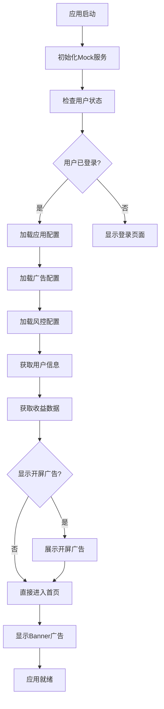

# Mock API使用指南

## 概述

本指南介绍如何使用完整的Mock API功能来模拟丁丁猫应用的所有后端接口，确保在开发环境中能够正常测试应用逻辑。

## 🚀 快速开始

### 1. 启用Mock模式

Mock模式默认在开发环境中启用，配置位于 `src/config/env.ts`：

```typescript
// 开发环境配置
const developmentConfig: EnvConfig = {
  MOCK_ENABLED: true,        // 启用Mock模式
  MOCK_USER_STATE: 1,        // 1: 登录状态, 0: 未登录状态
  DEBUG_MODE: true,          // 启用调试模式
  // ...其他配置
};
```

### 2. 验证Mock配置

在应用启动前，可以运行验证工具确保配置正确：

```javascript
// 在React Native调试控制台中运行
runCompleteValidation();
```

### 3. 测试所有Mock接口

```javascript
// 测试所有Mock API接口
testAllMockAPIs();
```

## 📋 支持的Mock接口

### 用户认证接口

| 接口 | Mock方法 | 说明 |
|------|----------|------|
| `/auth/wechat/login` | `mockWechatLogin()` | 模拟微信登录 |
| `/auth/wechat/register` | `mockWechatRegister()` | 模拟微信注册 |
| `/auth/userInfo` | `mockGetUserInfo()` | 获取用户信息 |

### 配置下发接口

| 接口 | Mock方法 | 说明 |
|------|----------|------|
| `/config` | `mockGetAppConfig()` | 应用基础配置 |
| `/config/ad` | `getMockAdConfig()` | 广告配置 |
| `/config/risk` | `mockGetRiskConfig()` | 风控配置 |
| `/config/channel` | `mockGetChannelConfig()` | 渠道配置 |

### 广告相关接口

| 接口 | Mock方法 | 说明 |
|------|----------|------|
| `/ad/request` | `mockAdRequest()` | 请求广告 |
| `/ad/show` | `mockAdShow()` | 广告展示回调 |
| `/ad/click` | `mockAdClick()` | 广告点击回调 |
| `/ad/complete` | `mockAdComplete()` | 广告完播回调 |
| `/ad/skip` | `mockAdSkip()` | 广告跳过回调 |
| `/ad/close` | `mockAdClose()` | 广告关闭回调 |
| `/ad/revenue` | `mockGetRevenue()` | 收益统计 |
| `/ad/history` | `mockGetAdHistory()` | 观看历史 |
| `/ad/batchReport` | `mockBatchReport()` | 批量上报 |

### 用户数据接口

| 接口 | Mock方法 | 说明 |
|------|----------|------|
| `/user/device` | `mockReportDeviceInfo()` | 设备信息上报 |

## 🔧 配置说明

### adConfig.js配置

广告相关配置位于 `src/config/adConfig.js`：

```javascript
const AdConfig = {
  // 穿山甲测试应用ID
  appId: '5001121',
  
  // 各类型广告位ID（使用穿山甲官方测试ID）
  splashAdId: '102117864',      // 开屏广告
  rewardVideoAdId: '945700410', // 激励视频
  interstitialAdId: '945493675', // 插屏广告
  bannerAdId: '945493677',      // Banner广告
  
  // 广告按钮配置
  adButtons: [
    {
      title: '开屏广告',
      adType: 'splash',
      adId: '102117864',
      enabled: true  // 控制是否启用
    },
    // ...其他广告类型
  ]
};
```

### Mock用户状态

可以通过以下方式切换用户状态：

```javascript
// 设置为登录状态
await mockService.setMockState(MockUserState.LOGGED_IN);

// 设置为未登录状态
await mockService.setMockState(MockUserState.NOT_LOGGED_IN);

// 切换状态
await mockService.toggleMockState();
```

## 🧪 测试工具

### 1. 完整验证工具

验证所有Mock配置和数据格式：

```javascript
// 运行完整验证
runCompleteValidation();
```

输出示例：
```
🔍 开始完整的Mock数据验证...

📋 验证adConfig.js配置...
结果: ✅ 通过
信息: adConfig.js配置验证通过

📊 验证Mock数据格式...
结果: ✅ 通过
信息: 所有Mock数据格式验证通过

⚙️ 验证Mock服务状态...
Mock服务状态: {
  初始化: ✅,
  Mock模式: ✅ 启用,
  用户状态: logged_in,
  用户登录: ✅
}

📈 验证总结:
🎉 所有验证都通过了！
💡 Mock数据配置正确，应用应该能正常显示用户信息和广告位。
🚀 现在可以启动应用进行测试。
```

### 2. API接口测试

测试所有Mock API接口：

```javascript
// 测试所有接口
testAllMockAPIs();
```

### 3. 应用启动流程验证

验证完整的应用启动流程：

```javascript
// 验证启动流程
const flowResult = await mockService.validateAppStartupFlow();
console.log(flowResult);
```

## 📱 应用启动流程

Mock模式下的应用启动流程：



## 🎯 使用场景

### 1. 开发调试

在开发过程中，使用Mock数据可以：
- 不依赖后端服务进行前端开发
- 测试各种数据状态和边界情况
- 验证UI组件的数据展示逻辑

### 2. 功能测试

使用Mock数据测试：
- 用户登录流程
- 广告加载和展示
- 收益统计显示
- 错误处理逻辑

### 3. 性能测试

通过调整Mock数据：
- 测试大量数据的渲染性能
- 模拟网络延迟情况
- 验证加载状态的显示

## 🔍 调试技巧

### 1. 查看Mock服务状态

```javascript
// 获取Mock服务详细状态
const status = mockService.getStatus();
console.log('Mock服务状态:', status);
```

### 2. 监控API调用

所有Mock API调用都会在控制台输出日志：

```
MockService: 广告展示上报 - 用户: 1001, 广告: test_ad_123, 类型: banner
MockService: 广告完播上报 - 用户: 1001, 广告: test_ad_123, 类型: reward_video, 奖励: 0.05
```

### 3. 自定义Mock数据

可以修改MockService中的方法来自定义返回数据：

```typescript
// 自定义用户数据
public generateMockUser(): LoginResponse {
  return {
    userId: 1001,
    userName: 'custom_user',
    nickName: '自定义用户',
    // ...其他字段
  };
}
```

## ⚠️ 注意事项

### 1. 生产环境

确保在生产环境中禁用Mock模式：

```typescript
// 生产环境配置
const productionConfig: EnvConfig = {
  MOCK_ENABLED: false,  // 生产环境必须禁用
  // ...其他配置
};
```

### 2. 数据一致性

Mock数据格式必须与真实API保持一致：
- 字段名称和类型
- 数据结构
- 错误响应格式

### 3. 测试覆盖

确保Mock数据覆盖所有可能的业务场景：
- 正常数据
- 边界数据
- 错误数据
- 空数据

## 🛠️ 故障排除

### 问题1: 首页显示"用户信息加载失败"

**解决方案:**
```javascript
// 1. 检查Mock模式是否启用
console.log('Mock启用:', mockService.isMockModeEnabled());

// 2. 检查用户状态
console.log('用户状态:', mockService.getCurrentMockState());

// 3. 强制设置为登录状态
await mockService.setMockState(MockUserState.LOGGED_IN);

// 4. 验证用户数据生成
const user = await mockService.mockGetUserInfo();
console.log('用户数据:', user);
```

### 问题2: 广告位不显示

**解决方案:**
```javascript
// 1. 检查广告配置
const adConfig = await mockService.getMockAdConfig();
console.log('广告配置:', adConfig);

// 2. 验证Banner广告配置
console.log('Banner启用:', adConfig.bannerAdConfig?.enabled);

// 3. 测试广告请求
const bannerAd = await mockService.mockAdRequest(1001, AdType.BANNER);
console.log('Banner广告:', bannerAd);
```

### 问题3: 开屏广告不跳转

**解决方案:**
```javascript
// 1. 检查开屏广告配置
const adConfig = await mockService.getMockAdConfig();
console.log('开屏广告配置:', adConfig.splashAdConfig);

// 2. 验证应用流程
const flowResult = await mockService.validateAppStartupFlow();
console.log('启动流程:', flowResult);
```

## 📚 相关文档

- [API接口文档](./API.md)
- [穿山甲集成指南](./PANGLE_API_INTEGRATION.md)
- [应用配置说明](./src/config/README.md)

## 🎉 总结

通过完整的Mock API功能，开发者可以：

1. **独立开发**: 不依赖后端服务进行前端开发
2. **全面测试**: 覆盖所有业务场景的测试
3. **快速调试**: 通过Mock数据快速定位问题
4. **验证逻辑**: 确保应用逻辑的正确性

Mock系统提供了与真实API完全一致的接口，确保开发和测试的可靠性。