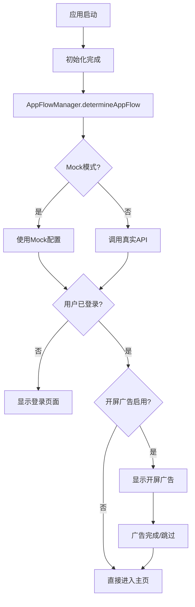
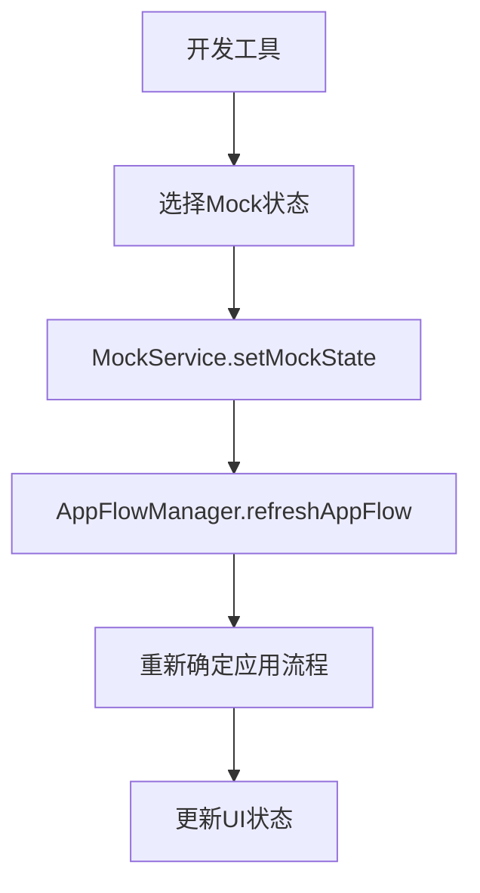

# Mock开发功能使用指南

## 概述

本文档介绍了丁丁猫应用中的Mock开发功能，包括开屏广告流程的模拟和测试。

## 功能特性

### 1. Mock服务 (MockService)

Mock服务提供了完整的开发环境模拟功能：

- **用户状态模拟**: 支持未登录、已登录、首次用户三种状态
- **配置模拟**: 提供应用配置、广告配置、风控配置的模拟数据
- **广告数据模拟**: 生成各种类型广告的模拟响应
- **收益数据模拟**: 提供用户收益和历史记录的模拟数据

### 2. 开屏广告流程 (SplashAdScreen)

完整的开屏广告展示组件：

- **API集成**: 与服务器广告配置接口集成
- **穿山甲SDK集成**: 支持真实广告SDK调用
- **事件上报**: 完整的广告事件追踪和上报
- **Mock模式**: 开发环境下的广告模拟
- **跳过功能**: 支持倒计时跳过和手动跳过

### 3. 应用流程管理 (AppFlowManager)

智能的应用启动流程控制：

- **状态判断**: 根据登录状态和配置决定应用流程
- **开屏广告控制**: 自动判断是否显示开屏广告
- **Mock集成**: 开发环境下的流程模拟

## 使用方法

### 1. 启用Mock模式

Mock模式通过环境变量控制，提供更简单直接的配置方式：

#### 环境变量配置 (推荐)

```bash
# .env 文件配置
MOCK_ENABLED=1          # 1: 开启Mock模式, 0: 关闭Mock模式
MOCK_USER_STATE=1       # 0: 未登录状态, 1: 登录状态
```

#### 配置说明

- `MOCK_ENABLED`: 控制是否启用Mock功能
  - `1` 或 `true`: 启用Mock模式，所有API调用使用模拟数据
  - `0` 或 `false`: 关闭Mock模式，使用真实API
  
- `MOCK_USER_STATE`: 控制模拟的用户登录状态
  - `0`: 未登录状态，显示微信登录页面
  - `1`: 登录状态，根据广告配置显示开屏广告或直接进入主页

#### 配置示例

```bash
# 测试未登录流程
MOCK_ENABLED=1
MOCK_USER_STATE=0

# 测试登录流程和开屏广告
MOCK_ENABLED=1
MOCK_USER_STATE=1

# 关闭Mock，使用真实API
MOCK_ENABLED=0
```

### 2. 使用开发工具

在主页面右上角点击🛠️按钮打开开发工具面板：

#### 环境变量显示：
- **MOCK_ENABLED**: 显示当前Mock模式开关状态
- **MOCK_USER_STATE**: 显示当前配置的用户状态
- **DEBUG_MODE**: 显示调试模式状态

#### 功能选项：
- **切换状态**: 循环切换用户模拟状态 (仅在未使用环境变量时有效)
- **设置特定状态**: 直接设置为未登录/已登录/首次用户
- **重置**: 清除所有模拟数据
- **测试开屏广告**: 检查当前状态下是否会显示开屏广告
- **刷新状态**: 重新加载当前系统状态

#### 优先级说明：
- **环境变量优先**: 如果设置了环境变量，将优先使用环境变量配置
- **手动设置**: 仅在未设置环境变量时，手动设置才会生效
- **状态显示**: 开发工具会同时显示环境变量状态和存储状态

#### 状态说明：
- **未登录 (0)**: 显示微信登录页面
- **已登录 (1)**: 根据广告配置显示开屏广告或直接进入主页

### 3. 测试开屏广告流程

#### 自动测试：
```typescript
import MockFlowTester from '../utils/testMockFlow';

// 运行完整测试套件
await MockFlowTester.runCompleteTestSuite();

// 测试特定状态
await MockFlowTester.testMockState(MockUserState.LOGGED_IN);

// 测试广告生成
await MockFlowTester.testMockAdGeneration();
```

#### 手动测试：
1. 打开开发工具
2. 设置用户状态为"已登录"
3. 点击"刷新应用流程"
4. 重启应用查看开屏广告效果

### 4. 控制台调试

在开发模式下，可以在控制台使用全局调试工具：

```javascript
// 获取系统状态
const status = await MockFlowTester.getSystemStatus();
console.log(status);

// 运行测试
await MockFlowTester.runCompleteTestSuite();

// 切换Mock状态
await mockService.toggleMockState();
```

## 配置说明

### 1. Mock广告配置

```typescript
const mockAdConfig = {
  splashAdConfig: {
    enabled: true,           // 是否启用开屏广告
    adId: 'mock_splash_ad_id', // 广告位ID
    timeout: 5000,          // 广告超时时间(ms)
    skipDelay: 3000,        // 跳过按钮延迟(ms)
  },
  // ... 其他广告类型配置
};
```

### 2. Mock用户数据

```typescript
const mockUser = {
  userId: 12345,
  userName: 'mock_user_12345',
  nickName: '测试用户12345',
  avatar: 'https://via.placeholder.com/100x100/1890FF/FFFFFF?text=Mock',
  // ... 其他用户信息
};
```

### 3. Mock收益数据

```typescript
const mockRevenue = {
  totalRevenue: 2580,      // 总收益(分)
  todayRevenue: 150,       // 今日收益(分)
  totalAdViews: 86,        // 总观看次数
  todayAdViews: 5,         // 今日观看次数
  remainingDailyViews: 45, // 剩余观看次数
  // ... 其他收益信息
};
```

## 开发流程

### 1. 开屏广告开发流程



### 2. Mock状态切换流程



## 注意事项

### 1. 环境限制
- Mock功能仅在DEBUG_MODE=true时可用
- 生产环境会自动禁用所有Mock功能
- 需要使用占位符的微信AppID和AppKey

### 2. 数据持久化
- Mock状态会保存在AsyncStorage中
- 重启应用后Mock状态会保持
- 可以通过重置功能清除所有Mock数据

### 3. 性能考虑
- Mock服务会模拟网络延迟(200-800ms)
- 大量测试时建议使用自动化测试工具
- 避免在生产代码中引用Mock相关模块

### 4. 调试技巧
- 使用开发工具面板进行可视化调试
- 查看控制台日志了解详细流程
- 使用MockFlowTester进行自动化测试
- 通过系统状态检查配置是否正确

## 故障排除

### 1. Mock模式未启用
检查环境配置：
```typescript
console.log('Debug mode:', ENV_CONFIG.DEBUG_MODE);
console.log('WeChat App ID:', ENV_CONFIG.WECHAT_APP_ID);
console.log('App Key:', ENV_CONFIG.APP_KEY);
```

### 2. 开屏广告不显示
检查配置和状态：
```typescript
const shouldShow = await mockService.shouldShowSplashAd();
const adConfig = await mockService.getMockAdConfig();
console.log('Should show splash ad:', shouldShow);
console.log('Splash config:', adConfig.splashAdConfig);
```

### 3. 状态切换无效
重新初始化服务：
```typescript
await mockService.reset();
await mockService.initialize();
```

## API参考

详细的API文档请参考各服务类的TypeScript定义：

- `MockService`: Mock数据和状态管理
- `AppFlowManager`: 应用流程控制
- `SplashAdScreen`: 开屏广告组件
- `MockFlowTester`: 测试工具类

## 更新日志

### v1.0.0
- 初始版本
- 支持基本的Mock功能
- 开屏广告流程实现
- 开发工具面板

### 后续计划
- 支持更多广告类型的Mock
- 增加网络状态模拟
- 添加性能监控Mock
- 支持自定义Mock数据